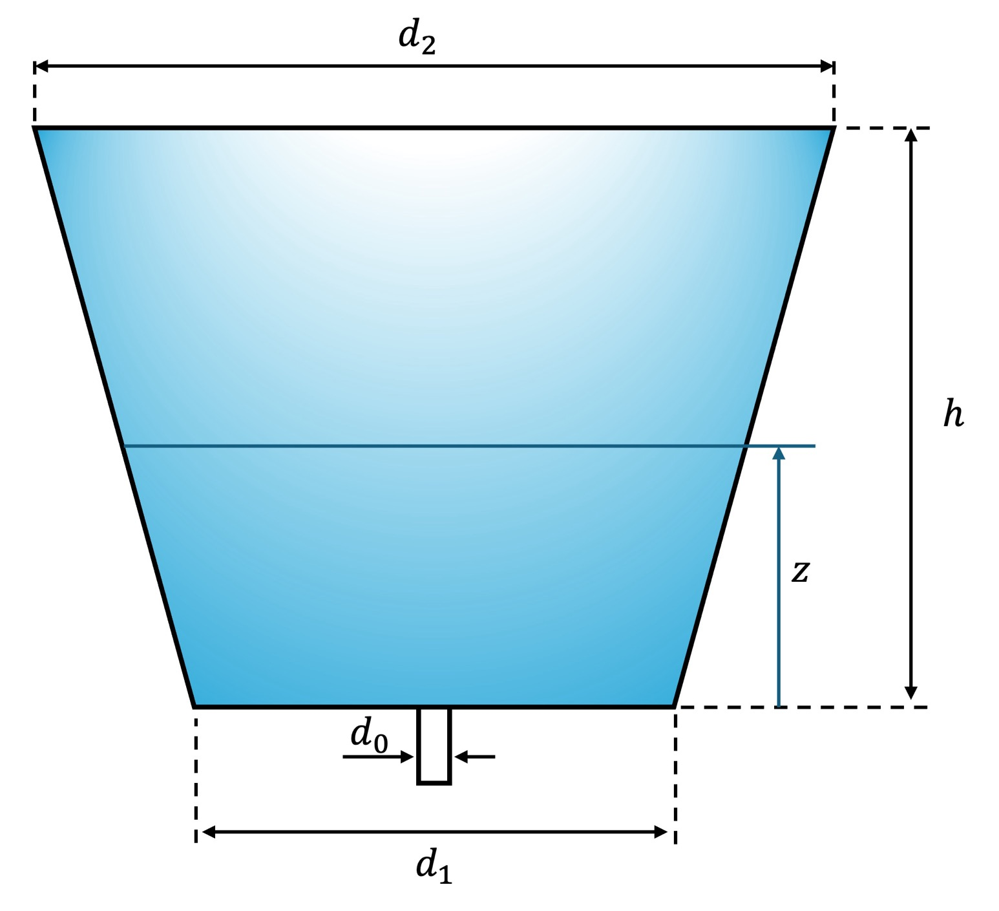

# 🌀 Analytical Drainage Model for Tanks with Deviated Walls

This repository contains a simple analytical model and accompanying code for predicting the **draining behavior of a tank with deviated (non-vertical) walls**.  
The work was motivated by a fluid-mechanics puzzle shared on LinkedIn, where two tanks with identical volume and orifice size drained at different rates due solely to geometry.

The goal of this project is to provide a clean analytical solution and a small piece of code that demonstrates how geometry controls draining dynamics.

---

## 📘 Problem Description

We analyze a tank defined by:

- **Top diameter:** `d2`  
- **Bottom diameter:** `d1`  
- **Tank height:** `h`  
- **Orifice diameter:** `d0`  
- **Instantaneous water height:** `z`

The cross-sectional area changes with height because the walls are not vertical.

A schematic of the geometry is shown below:

---

## 🧮 Analytical Solution

Applying **Bernoulli’s equation** between the free surface and the orifice, along with **continuity**, yields an explicit formula for the free-surface velocity:

\[
V_1(z) =
\sqrt{
\frac{2 g z}{
\left(\dfrac{A_1(z)}{A_2}\right)^2 - 1
}
}
\]

where  
- \( A_1(z) = \frac{\pi}{4} d(z)^2 \) is the tank area at height `z`,  
- \( A_2 = \frac{\pi}{4} d_0^2 \) is the orifice area.

The exit velocity follows from continuity:

\[
V_2(z) = \frac{A_1(z)}{A_2}\,V_1(z).
\]

This framework allows you to compute:

- Instantaneous draining velocity  
- Time evolution of water height  
- Total draining time (via numerical integration)  
- Comparisons of different tank geometries  

---

## 📂 Repository Structure

